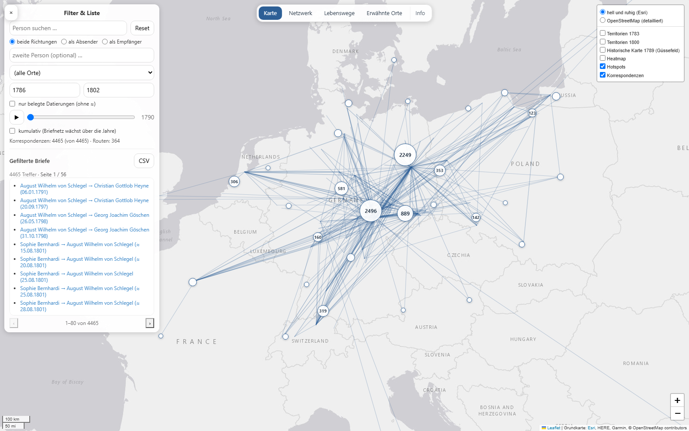
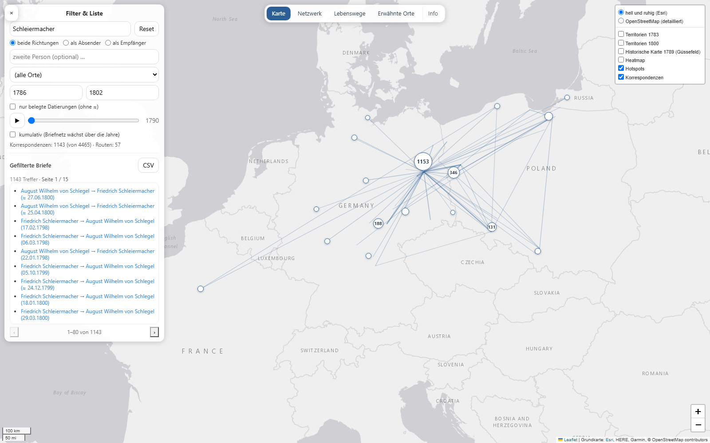
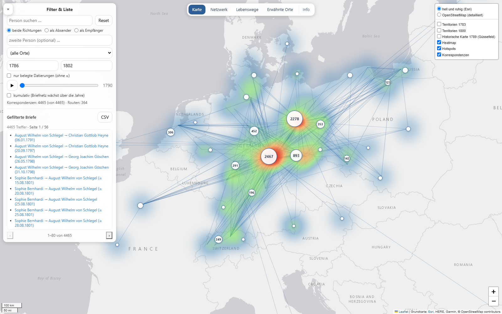
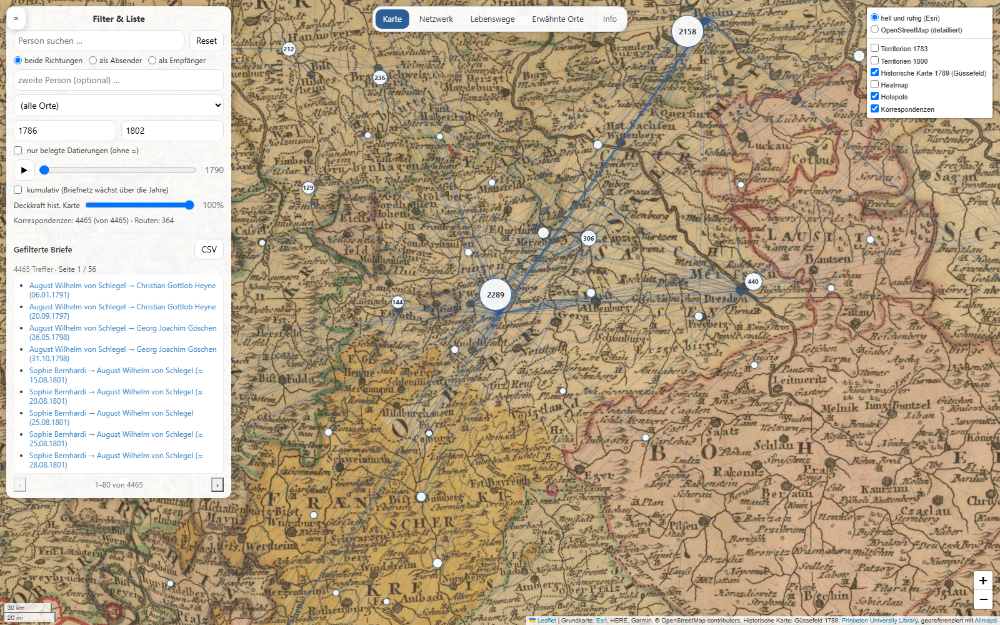
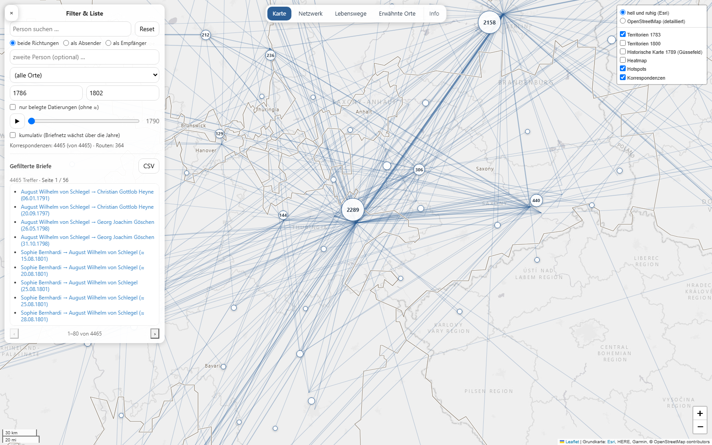
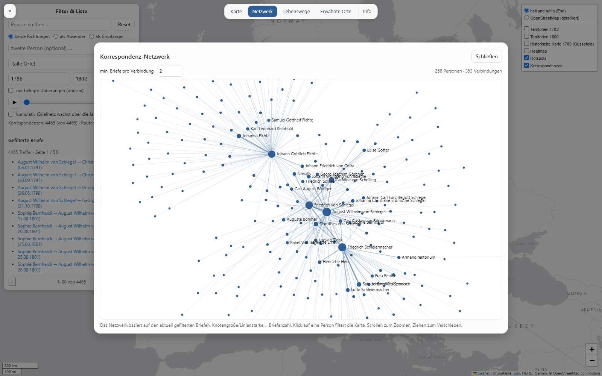
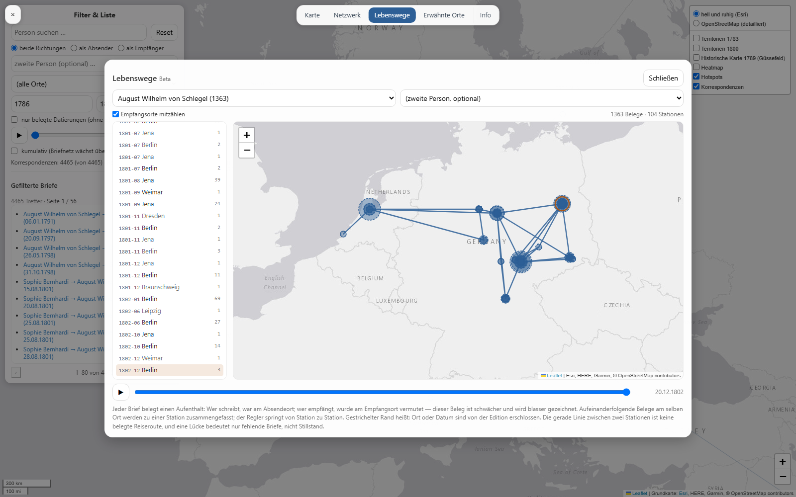
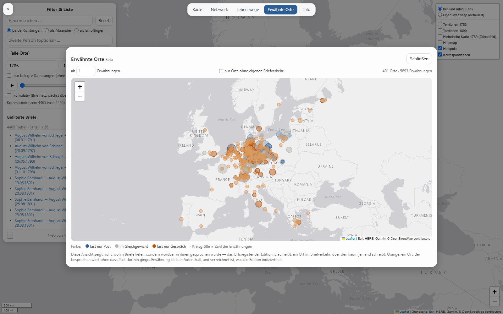

# RomKorr – Interaktive Karte der Korrespondenzen der Frühromantik

**RomKorr** ist ein Python-basiertes Projekt zur Aufbereitung, Analyse und Visualisierung
von Brief-Korrespondenzen der Frühromantik. Es kann ebenso für andere Korrespondenzen genutzt und angepasst werden.

Zentrales Ergebnis ist eine **interaktive Webkarte (HTML)**, die räumliche
Korrespondenzbeziehungen sichtbar macht und über Filter explorierbar ist.

Die Karte eignet sich für **Exploration der Briefe**, **Forschung**, **Lehre** und **öffentliche Präsentation** (z. B. Einbindung auf einer Website).

---

## Ansichten

| | |
|---|---|
|  **Start:** Routen zwischen Absende- und Empfangsort; Filter und Trefferliste links, Ebenen rechts. |  **Personenfilter:** alle Briefe von und an Schleiermacher, mit Hotspots. |
|  **Heatmap:** Dichte der Brieforte, folgt den Filtern. |  **Historische Karte:** Güssefeld 1789, georeferenziert mit Allmaps. |
|  **Territorien:** Grenzverläufe um 1783 bzw. 1800 als eigene Ebenen. |  **Netzwerk:** wer schrieb wem — Klick auf eine Person filtert die Karte. |
|  **Lebenswege (Beta):** eine Person über ihre Aufenthaltsorte durch die Zeit. |  **Erwähnte Orte (Beta):** worüber geschrieben wurde — orange heißt: besprochen, aber ohne Briefverkehr. |

---

## Projektidee

Das Projekt verfolgt drei Hauptziele:

1. **Datenintegration**  
   Sammlung und Vereinheitlichung von Briefmetadaten (Sender, Empfänger, Datum, Ort). Optional: Web-Scraping, um Daten zu erhalten.

2. **Räumliche Modellierung**  
   Geokodierung von Absende- und Empfangsorten sowie Ableitung räumlicher Beziehungen.

3. **Explorative Visualisierung**  
   Darstellung der Korrespondenzen als:
   - Linien (Absendeort → Empfangsort)
   - Heatmap und Hotspots
   - filterbare Ergebnisliste mit CSV-Export

---

## Ordnerstruktur

│
├── data/
│ ├── raw/ # Rohdaten und Nachschlagewerke
│ │ ├── place_coords.csv # Ortsverzeichnis (Koordinaten aus Normdaten)
│ │ ├── mentions.csv # im Brieftext erwähnte Orte je Brief
│ │ ├── borders_1783.geojson # historische Territorien (zugeschnitten)
│ │ ├── borders_1800.geojson
│ │ └── georef_map.json # Allmaps-Annotation der Karte von 1789
│ └── processed/ # Aufbereitete Daten (zentrale Arbeitsbasis)
│ ├── letters_master.csv
│ ├── letters_master.parquet
│ └── places_agg.parquet
│
├── src/
│ └── romkorr/
│ ├── 01_RomKorr_Scraper_clean.ipynb
│ ├── 02_RomKorr_DataPrep.ipynb
│ └── 03_RomKorr_MapBuilder.ipynb
│
├── outputs/
│ ├── romkorr_map.html # Aktuelle finale Karten-HTML
│ └── alt/ # Frühere Karten-Versionen (nicht versioniert)
│
├── tools/ # Hilfsskripte
│ ├── check_gcps.py # Passpunkte der Georeferenzierung prüfen
│ ├── tps_fold.py # Faltungen der Georeferenzierung finden
│ ├── prepare_borders.py # historische Territorialgrenzen aufbereiten
│ └── prepare_mentions.py # erwähnte Orte aus dem Register lesen
│
├── screenshots/ # Ansichten der Karte (Dokumentation)
│
├── backup/ # Manuelle Sicherungen (nicht versioniert)
│
└── requirements.txt # Python-Abhängigkeiten

---

## Empfohlener Workflow

Die **aktuelle und aktive Pipeline** befindet sich vollständig unter:

src/romkorr/

Die Notebooks sind nummeriert und werden **in dieser Reihenfolge** ausgeführt.

---

## 1. Scraping und Rohdaten  
### `01_RomKorr_Scraper_clean.ipynb`

**Zweck**
- Sammlung bzw. Import von Briefmetadaten
- Die zu prüfenden IDs kommen aus der **`sitemap.xml`** der Edition (statt einen
  ID-Bereich zu raten); ergänzt um die IDs des letzten Laufs, weil die Sitemap
  vereinzelt Briefe auslässt
- Erfassung von Quell-URLs sowie der **Normdaten-Links je Ort** (GeoNames **und** GND),
  wie sie die Briefseiten selbst verlinken
- Zusätzlich wird die **TEI-Fassung** jedes Briefes geladen
  (`/letters/xml/<id>`): Sie enthält das Datum maschinenlesbar als `@when` —
  auch bei unscharfen Angaben wie „[vor dem 22.04.1790]" oder „Sommer 1793".
  Gelesen wird gezielt `<correspAction type="sent">`, denn der TEI-Header trägt
  unter `<publicationStmt>` ein zweites Datum (das der Veröffentlichung)
- Die Metadaten-Labels der Website werden **deutsch und englisch** erkannt; die
  Edition liefert beide Sprachfassungen gemischt aus

**Ergebnis**
- Rohdaten (CSV) in `data/raw/`, gefiltert in `data/processed/rom_korr_full_website.csv`
- Noch keine Geokoordinaten (die entstehen in 02 aus den Normdaten-Links)

**Seiten-Cache**
Jede Briefseite und jede TEI-Datei wird lokal abgelegt, damit ein abgebrochener Lauf
ohne neue Abrufe weitergehen kann — rund 10.000 Dateien. Der Cache liegt bewusst
**außerhalb** des Projektordners, weil dieser hier in einem synchronisierten Laufwerk
liegt; voreingestellt ist `%LOCALAPPDATA%\romkorr_scrape_cache` (unter Linux/macOS
`~/.cache/romkorr`). Mit der Umgebungsvariablen `ROMKORR_CACHE` lässt sich ein anderer
Ort vorgeben; `tools/prepare_mentions.py` liest denselben Cache.

Dieses Notebook muss nur neu ausgeführt werden, wenn sich die Quelldaten ändern.

---

## 2. Datenaufbereitung und Geokodierung  
### `02_RomKorr_DataPrep.ipynb`

**Zweck**
- Bereinigung und Normalisierung der Rohdaten
- **Datum** primär aus dem TEI (`@when`), der Prosa-Parser nur als Rückfall.
  Erschlossene Datierungen werden als `date_inferred` gekennzeichnet, damit die
  Karte sie nicht als taggenau ausgibt
- Koordinaten **je Ort** aus **Normdaten** (Kaskade: GeoNames-Link → GND via
  lobid.org), festgehalten in `data/raw/place_coords.csv`. Was dort steht, wird
  nicht erneut geholt; dort sind auch manuelle Korrekturen möglich (`lat`/`lon`
  eintragen, Quelle `manuell` vermerken). Zugeordnet wird über GeoNames-URL, sonst
  GND-URL, sonst Ortsname — Letzteres nur bei eindeutigen Namen, damit gleichnamige
  Orte unterscheidbar bleiben
- Erschlossene **Orte** werden aus der Anmerkung der Edition erkannt (`dispatch_inferred`, `destination_inferred`) — die Orte gelten als gültig,
  die Unsicherheit wird aber mitgeführt
- „Unbekannt" als Ortsname erhält keine Koordinaten
- Vereinheitlichung von Ortsnamen und Harmonisierung abweichender Koordinaten
- Erzeugung einer konsistenten Master-Datei

**Ergebnis**
- `data/processed/letters_master.csv`
- `data/processed/letters_master.parquet`
- optionale Aggregationen (z. B. `places_agg.parquet`)

Diese Dateien bilden die **Grundlage aller weiteren Analysen und Visualisierungen**.

---

## 3. Karten- und Website-Generierung  
### `03_RomKorr_MapBuilder.ipynb`

**Zweck**
- Erzeugung der interaktiven Karte mit **Folium und JavaScript**
- Aufbau der Benutzeroberfläche: drei Zonen — Filter und Trefferliste links,
  Ebenen rechts, Ansichtswechsel oben (`Karte · Netzwerk · Lebenswege · Erwähnte
  Orte · Info`). Netzwerk, Lebenswege und Erwähnte Orte sind keine Kartenfunktionen,
  sondern eigene Lesarten desselben Bestands — zwei davon bringen eine eigene
  Leaflet-Instanz mit; die Leiste liegt über den Ansichten, man kann also direkt
  zwischen ihnen wechseln
- Filter nach:
  - Person (Suchfeld über alle Personen, findet auch Teilnamen wie „Schlegel"),
    wahlweise eingeschränkt auf ihre Rolle als Absender oder Empfänger
  - zweite Person (optional): zeigt nur die Briefe zwischen beiden; zusammen mit
    der Richtungswahl also gezielt „A schreibt an B"
  - Ort (Dropdown passt sich den übrigen Filtern dynamisch an); der gewählte Ort
    wird angefahren und farbig hervorgehoben — auch dann, wenn er noch in einem
    Cluster steckt
  - Jahr (von / bis), optional nur belegte Datierungen (schließt erschlossene aus)
- Darstellung von:
  - Korrespondenz-Routen (gebündelt; Liniendicke/Deckkraft = Briefanzahl, Klick zeigt Richtungs-Statistik)
  - filterabhängige Heatmap (Verlauf blau→grün→rot), im Ebenen-Menü zuschaltbar
  - **Territorien 1783 und 1800** als zuschaltbare Ebenen (53 bzw. 50 Gebiete mit Namen), aus dem
    Datensatz [historical-basemaps](https://github.com/aourednik/historical-basemaps)
    (GPL-3.0). Zwei Stützjahre, weil beide etwas anderes zeigen: **1783** liegt nahe an
    der Güssefeld-Karte von 1789 und kennt noch Polen, die Niederlande und die Alte
    Eidgenossenschaft; **1800** liegt näher am Schwerpunkt des Bestands (Median 1798,
    77 % ab 1795) und zeigt Batavische und Helvetische Republik. Aufbereitet von
    `tools/prepare_borders.py`; Beschriftungen erscheinen zoomabhängig, damit
    Kleinstaaten die Übersicht nicht zustellen
  - Hotspots als Proportionalkreise, von Anfang an sichtbar (Kreisfläche und Zahl =
    Briefanzahl im aktiven
    Filter — Kreise wachsen, schrumpfen und verschwinden mit Person-/Ort-/Jahresfilter
    und Zeit-Animation; benachbarte Orte verschmelzen beim Herauszoomen und teilen
    sich per Klick). Auch die Orts-Popups (Anzahl, Beispiele, Listen-Button) werden
    beim Öffnen aus dem aktiven Filter gebaut
  - Briefe mit nur einem bekannten Ort (Gegenstelle „Unbekannt") zählen am bekannten
    Endpunkt mit und erscheinen in Liste, CSV und Popups — nur ohne Linie
  - **Erschlossene Datierungen** sind mit „≈" gekennzeichnet; der Wortlaut der Edition
    (z. B. „[vor dem 22.04.1790]") erscheint im Tooltip und im CSV-Export. Ohne „≈" ist
    das Datum im Brief selbst belegt
  - Zeit-Animation (Jahres-Slider mit Play-Button, Einzeljahr oder kumulativ)
  - Netzwerk-Ansicht (wer schrieb wem, d3-force; Klick auf Person filtert die Karte)
  - **Lebenswege (Beta)**: eigene Ansicht, die eine Person über ihre Aufenthaltsorte durch die
    Zeit verfolgt. Aufenthaltsbelege sind Absendeorte (stark) und Empfangsorte (schwächer,
    abschaltbar); aufeinanderfolgende Belege am selben Ort werden zu Stationen zusammengefasst,
    ein Regler springt von Station zu Station. Zwei Personen lassen sich vergleichen.
    Erschlossene Orte und Daten sind gestrichelt gezeichnet. Läuft auf einer eigenen
    Karteninstanz, damit die Hauptkarte unberührt bleibt
  - **Erwähnte Orte (Beta)**: eigene Ansicht der „Gesprächsgeografie" — nicht wohin Briefe
    liefen, sondern worüber in ihnen gesprochen wurde. Grundlage ist das Ortsregister der
    Edition (`tools/prepare_mentions.py`, gelesen aus dem lokalen Seiten-Cache). Kreisgröße =
    Zahl der Erwähnungen, Farbe = Verhältnis zwischen Erwähnung und Briefverkehr auf einer
    zweipoligen Skala (blau: vor allem Poststation, orange: wird besprochen, ohne dass Post
    dorthin ging). 401 Orte, davon 261 ohne eigenen Briefverkehr
  - Ergebnisliste mit Pagination
- Historische Karten-Ebene: F. L. Güssefeld, „Charte das Deutsche Reich" (Nürnberg 1789,
  Homännische Erben) als zuschaltbares Overlay über der modernen Karte — Punkte, Linien
  und Heatmap bleiben darüber sichtbar, die Deckkraft ist per Regler einstellbar.
  Die Karten-Referenz stammt aus `data/raw/georef_map.json` (Allmaps-Georeferenzierungs-Annotation);
  die Kacheln liefert der Allmaps-Tileserver live aus dem IIIF-Digitalisat der
  Princeton University Library — im Repo liegen keine Kartenbilder.
  Entzerrt wird per **Thin Plate Spline** (`HIST_TRANSFORMATION`), damit das Blatt
  exakt durch die Passpunkte läuft; die affine Alternative `polynomial` weicht am
  Kartenrand um mehrere Dutzend Kilometer ab. Die Kachel-URL adressiert die
  **versionierte** Map-Referenz (`<id>@<version>`), weil der Tileserver Kacheln pro
  Map-ID 30 Tage cacht: Ohne Version kämen nach einer Korrektur im Allmaps-Editor
  weiterhin veraltete Kacheln. Umgekehrt heißt das: Nach einer Editor-Änderung muss
  `georef_map.json` neu geladen und die Karte neu gebaut werden.
- CSV-Export der gefilterten Briefe (Excel-kompatibel, UTF-8-BOM)
- Permalink: Filterzustand steht in der URL und ist als Link teilbar

**Ergebnis**
- Statische HTML-Datei:

outputs/romkorr_map.html


Diese Datei kann direkt lokal geöffnet oder auf einer Website veröffentlicht werden.

---

## Prüfwerkzeuge für die Georeferenzierung (`tools/`)

Zwei eigenständige Skripte prüfen die Allmaps-Annotation, bevor sie in die Karte geht.
Ohne Argument nehmen sie `data/raw/georef_map.json`; beide melden Funde per Exit-Code 1.

```bash
python tools/tps_fold.py     # Faltungen der Thin Plate Spline finden
python tools/check_gcps.py   # widersprüchliche Passpunkte finden
```

`tps_fold.py` rechnet die Transformation unabhängig vom Tileserver nach und sucht über
die Jacobi-Determinante nach Stellen, an denen sich das Kartenblatt überschlägt — dort
erscheint der Kartenstich verschmiert oder mit Löchern. Gemeldet wird der betroffene
Bereich in Bild- und Weltkoordinaten.

`check_gcps.py` sucht den Verursacher. Der aussagekräftigste Test ist der
Nord/Süd-Vergleich: Liegt ein Passpunkt im Scan oberhalb seines Nachbarn, muss er
auch nördlicher liegen — Verstöße sind fast immer Eingabefehler. Zusätzlich wird je
Punkt eine Leave-one-out-Abweichung gegen die Nachbarschaft berechnet. Am Kartenrand
sind große Werte dort normal, weil die Karte von 1789 selbst ungenau ist (Längengrade
waren damals fehleranfällig, Randstaaten weniger sorgfältig konstruiert).

Nützlich sind die Skripte besonders beim Wechsel auf Thin Plate Spline: Die affine
Transformation mittelt einen falschen Passpunkt weg, TPS zwingt sich exakt durch ihn
hindurch und faltet dabei die Umgebung.

---

## Datenhilfen (`tools/`)

Zwei weitere Skripte erzeugen Zusatzdaten für die Karte. Beide laufen selten — nur,
wenn die Grundlage sich ändert — und schreiben nach `data/raw/`.

```bash
python tools/prepare_borders.py          # beide Stützjahre; oder: ... 1800
python tools/prepare_mentions.py         # optional: Pfad zum Seiten-Cache
```

`prepare_borders.py` lädt die Weltdatei des Datensatzes
[historical-basemaps](https://github.com/aourednik/historical-basemaps) (GPL-3.0),
schneidet sie mit Sutherland-Hodgman auf den Briefraum zu, führt gleichnamige Gebiete
zusammen und berechnet je Gebiet einen Beschriftungspunkt samt Mindest-Zoomstufe.
Der Zuschnitt spart den größten Teil der 1,8 MB; eine Geometrie-Bibliothek ist nicht nötig.

`prepare_mentions.py` liest das Ortsregister der Briefseiten aus dem Seiten-Cache von
Notebook 01 (s. u.) und schreibt `data/raw/mentions.csv`. Die Register-Einträge tragen
GND- und GeoNames-Nummern, sodass die Koordinaten über dieselbe Kaskade wie in Notebook 02
aufgelöst und in `place_coords.csv` ergänzt werden. Nur für noch unbekannte Orte geht
eine Anfrage hinaus; an die Edition selbst geht keine.

---

## Hinweise zu historischen Dateien (`alt/`)

Der Ordner `alt/` enthält:
- frühere Entwicklungsstände
- Experimente
- ältere Datenformate
- ältere Karten-Versionen

Diese Dateien sind **nicht Teil der aktuellen Pipeline** und dienen ausschließlich
der Dokumentation der Projektentwicklung.

---

## Abhängigkeiten

Getestet mit Python 3.11 (Conda):

- numpy  
- pandas  
- folium  
- branca  
- requests, beautifulsoup4 (nur für das Scraping-Notebook)  
- pyarrow (Parquet-Dateien)  

Empfohlene Einrichtung:

```bash
conda create -n romkorr python=3.11
conda activate romkorr
pip install -r requirements.txt
```

---

## Veröffentlichung und Nutzung

- Die erzeugte HTML ist **statisch** (kein Server notwendig) — die eine Datei
  `outputs/romkorr_map.html` kann direkt auf einen Webspace hochgeladen werden.
- Es werden keine personenbezogenen Daten von Besuchern verarbeitet.
- Externe Inhalte (werden beim Öffnen aus dem Internet geladen):
  - Esri „World Light Gray" (helle Basiskarte, voreingestellt) und OpenStreetMap
    (detailliert), im Ebenen-Menü umschaltbar / Leaflet — bewusst nicht CARTO:
    deren anonyme Kacheln tragen seit Kurzem ein „API KEY REQUIRED"-Wasserzeichen
  - Allmaps-Tileserver (`allmaps.xyz`) — Kacheln der historischen Karte
    (Güssefeld 1789; Digitalisat: Princeton University Library, per IIIF)
  - d3.js via jsDelivr-CDN (nur für die Netzwerk-Ansicht)
  - Verlinkungen auf öffentlich zugängliche Briefquellen (briefe-der-romantik.de)
- Die Karte startet mit Routen und Hotspots; die Heatmap und die historischen
  Ebenen werden oben rechts zugeschaltet.
- Bei Veröffentlichung sollte die Datenschutzerklärung auf externe Kartendienste,
  CDN-Einbindung und ausgehende Links hinweisen.

---

## Status und Weiterentwicklung

Der aktuelle Stand bietet:

- stabilen, reproduzierbaren Workflow (Koordinaten aus Normdaten GeoNames/GND
  statt blindem Geocoding; inkl. Harmonisierung fehlerhafter Geokodierungen)
- Datierung aus dem TEI (`@when`), erschlossene Angaben als solche gekennzeichnet
- kombinierbare Filter: Person (Suchfeld), zweite Person, Richtung, Ort, Jahr,
  Route, nur belegte Datierungen
- Routen-Bündelung, filterabhängige Heatmap und Hotspots, Zeit-Animation
- Netzwerk-Ansicht der Korrespondenzen
- Lebenswege und erwähnte Orte als eigene Beta-Ansichten
- historische Karten-Ebene (Güssefeld 1789, georeferenziert mit Allmaps) sowie
  Territorien um 1783 und 1800
- zwei Basiskarten zur Wahl (Esri hell voreingestellt, OpenStreetMap detailliert)
- einheitliches, validiertes Farbschema „Tinte & Preußischblau" (lesbar auf
  moderner wie historischer Karte, farbfehlsichtigkeits-geprüft)
- Permalinks und CSV-Export

Ideen für Erweiterungen:

- visuelle Kodierung der Korrespondenzrichtung (Pfeile oder Farbverlauf)
- gebogene Linien (trennt Hin- und Rückrichtung optisch)
- Statistik-Panel (Briefe pro Jahr zum aktuellen Filter)
- Personen-Profile (Steckbrief mit Top-Partnern und -Orten)
- Auslagerung der Briefdaten in eine separate JSON-Datei (schnelleres Laden)